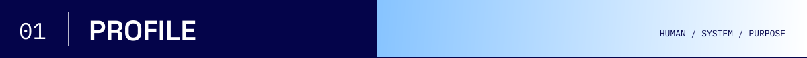
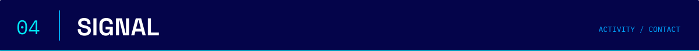

<h1></h1>

<picture>
  <source media="(prefers-reduced-motion: no-preference)" srcset="https://readme-typing-svg.demolab.com?font=JetBrains+Mono&weight=600&size=20&pause=900&color=00E7F5&center=true&vCenter=true&width=1000&height=64&lines=Information+Systems+%2B+Artificial+Intelligence;Creative+Technologist+%2B+Visual+Storyteller;Building+Human-Centered+Systems" />
  
</picture>

<h2></h2>

I'm Ted, an Information Systems and AI student in Malaysia. I build at the point where technology, design, and people meet—turning complex ideas into systems that feel clear, useful, and human.

As a Society Chairperson, I've learned that direction matters, but people matter more. I bring that into every project: listen closely, make the goal visible, and help the team move together.

> **NEXT EXPERIMENT / FORECAST** — I'm exploring AI-assisted tools that make difficult ideas easier to understand. The next build starts with a human problem, not a feature list.

<h2></h2>

  

### The Celestial Archive · 天穹秘典

I built The Celestial Archive as a calm, private place for reflection across mobile and desktop. Its complete 78-card system supports a bilingual experience, while readings stay on the user's device unless they choose otherwise.

`78 CARDS` · `BILINGUAL` · `LOCAL-FIRST` · `MOBILE + DESKTOP`

<h2></h2>

**BUILD** — Python · JavaScript · HTML · CSS · SQL · React · Node.js · Git · GitHub

**LEAD** — Society chairmanship · School and state event coordination · Debate · Chess

**CREATE** — Figma · Photoshop · Premiere Pro · Final Cut Pro · Photography · Visual storytelling

I earned a Gold Medal for an AI-based video project, but the result I value most is learning how to connect technical thinking with a story people can actually follow.

<h2></h2>

<picture>
  <source media="(prefers-reduced-motion: no-preference)" srcset="https://raw.githubusercontent.com/ted0103/ted0103/gh-pages/profile-cosmic-animate.svg" />
  
</picture>

### Have an idea worth making clear?

