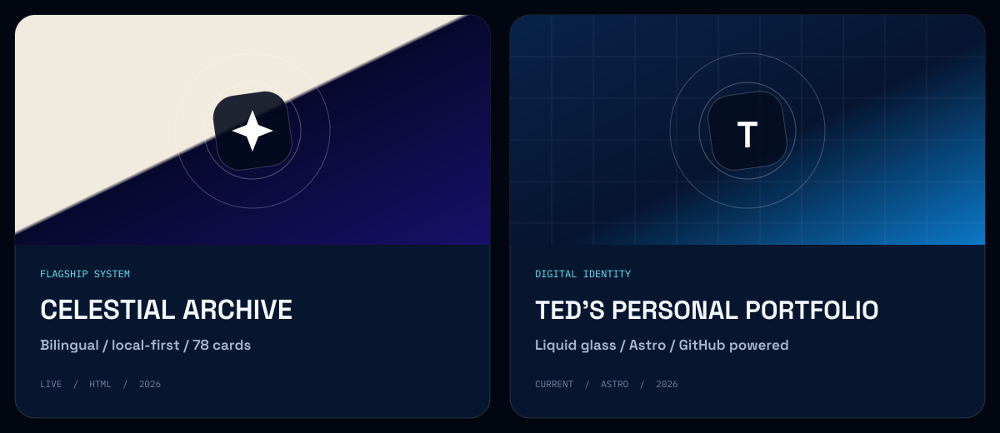

<h2></h2>

I’m Ted, an Information Systems and AI student in Malaysia. I build where technology, design, and people meet—turning complex ideas into systems that feel clear, useful, and human.

Chairing a society taught me that direction matters, but people matter more. I bring that into every project: listen closely, make the goal visible, and help the team move together.

**SELECTED SIGNALS** — Gold Medal, AI Video Project · Society Chairperson · School + State Event Coordination · Debate + Chess

> **NEXT EXPERIMENT / FORECAST** — I’m exploring AI-assisted tools that make difficult ideas easier to understand. The next build starts with a human problem, not a feature list.

<h2></h2>

### Celestial Archive · 天穹秘典

A bilingual, local-first 78-card reflection experience designed as a calm and private space across mobile and desktop.

### Ted’s Personal Portfolio

A fast, accessible multi-page portfolio with a restrained liquid-glass system and a curated GitHub-powered project architecture.

<h2></h2>

### Languages

### Development

### Design & Creative Tools

`SQL` · `FINAL CUT PRO` · `FUJIFEED`

<h2></h2>

<picture>
  <source media="(prefers-reduced-motion: no-preference)" srcset="https://raw.githubusercontent.com/ted0103/ted0103/gh-pages/profile-cosmic-animate.svg" />
  
</picture>

### Have an idea worth making clear?

