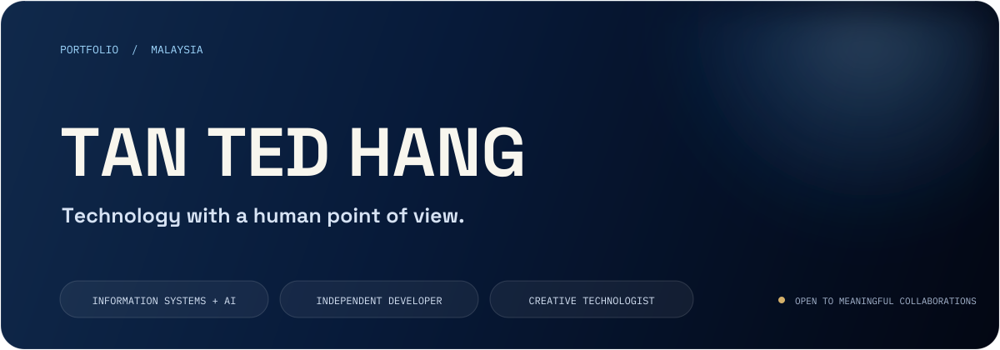
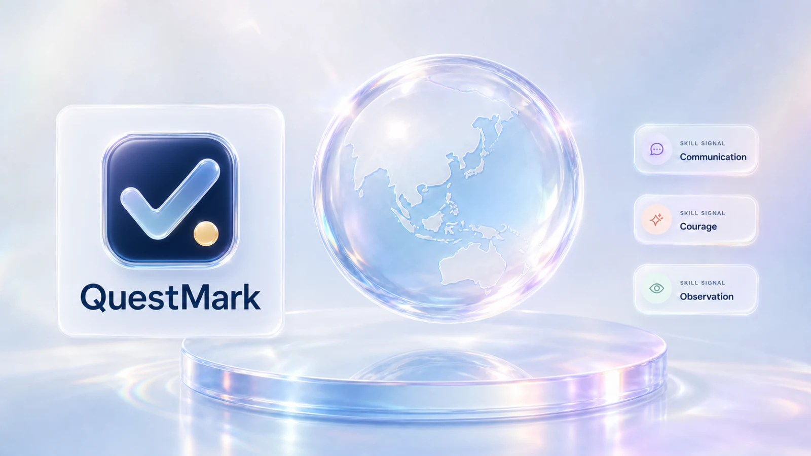
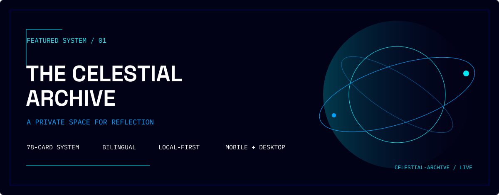
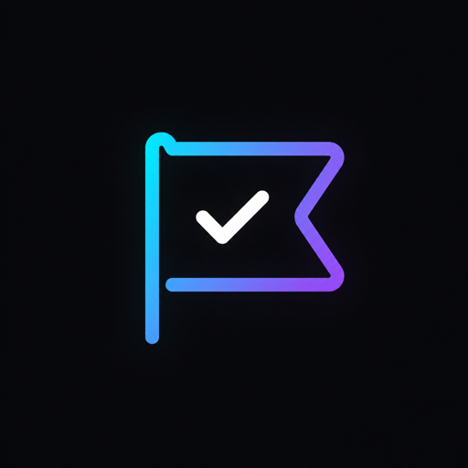
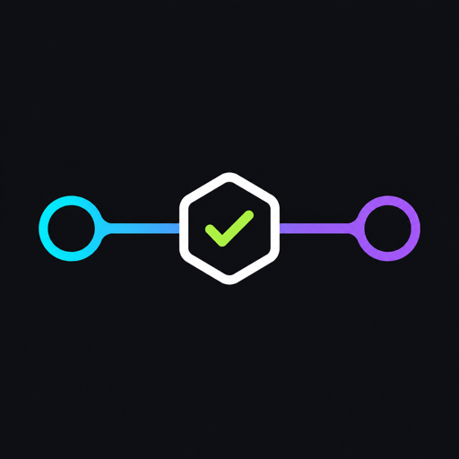

<picture>
  <source media="(prefers-reduced-motion: reduce)" srcset="./assets/profile/typing-static.svg" />
  
</picture>

 

   

## `01 / PROFILE`

I’m Ted, an Information Systems and AI student in Malaysia. I build where technology, design, and people meet—turning complex ideas into systems that feel clear, useful, and human.

Chairing a society taught me that direction matters, but people matter more. I bring that into every project: listen closely, make the goal visible, and help the team move together.

`GOLD MEDAL · AI VIDEO PROJECT` · `SOCIETY CHAIRPERSON` · `SCHOOL + STATE EVENT COORDINATION` · `DEBATE + CHESS`

> **NEXT EXPERIMENT** — I’m exploring AI-assisted tools that make difficult ideas easier to understand. The next build starts with a human problem, not a feature list.

## `02 / FEATURED SYSTEMS`

### QuestMark

An installable, private-by-default PWA that sends students into the real world, then turns mission evidence and reflection into Proof Cards, XP, achievements, and a visible skill map.

`REAL-WORLD QUESTS` · `EVIDENCE-BACKED SKILLS` · `OFFLINE PWA` · `LIQUID GLASS UI`

 

### Celestial Archive · 天穹秘典

A bilingual, local-first 78-card reflection experience designed as a calm and private space across mobile and desktop.

`78 CARDS` · `BILINGUAL` · `LOCAL-FIRST` · `MOBILE + DESKTOP`

 

## `03 / OPEN SOURCE`

### Project Checkpoint

Portable, integrity-checked Git handoffs that preserve the working source, accepted decisions, and exact next action.

 

### Review Money Movement

Evidence-first review for code that transfers, calculates, settles, refunds, or reconciles money.

## `04 / CAPABILITIES`

### Languages

### Development

### Design & Creative Tools

`SQL` · `FINAL CUT PRO` · `FUJIFEED`

I use code to make ideas work and creative tools to make them understood. The toolkit will change as I learn; the goal stays the same—choose what helps the idea communicate clearly.

## `05 / ACTIVITY`

<picture>
  <source media="(prefers-reduced-motion: reduce)" srcset="./assets/profile/activity-static.svg" />
  
</picture>

 

